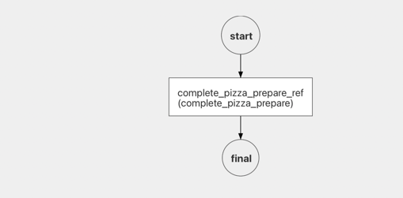

# netflix-conductor-sample

# Project Setup 
1. clone the repository 
```
git clone git@github.com:my1795/netflix-conductor-sample.git 
```

2. change directory to project 
```
cd netflix-conductor-sample
```

3. Change directory to compose file and run docker compose 
```
cd docker-compose
docker compose  up
```
# UI access

* visit http://localhost:5000 for netflix conductor UI 
* visit http://localhost:8080 for netflix conductor server swagger UI

# Workers Implementation 
 Workers are implemented under workers director. It is automatically build and run within docker compose file.
Please evaluate inside the project to see how they are implemented

# DEMONSTRATION 
 ## Preparation 
 ### Explanation
 First, workerflow definitions must be created against the conductor server. The workflow definitions are under workflow directory. 
 summarize_population workflow includes fork join task and HTTP task
 pizza_order workflow and pizza_prepare workflow are samples to use events 

## Workflow definition creation 
 Run in project root 
```
curl -X 'POST' \
'http://localhost:8080/api/metadata/workflow' \
-H 'accept: */*' \
-H 'Content-Type: application/json' \
-d @workflow/summarize_population.json
```
```
curl -X 'POST' \
'http://localhost:8080/api/metadata/workflow' \
-H 'accept: */*' \
-H 'Content-Type: application/json' \
-d @workflow/pizza_order.json
```
```
curl -X 'POST' \
'http://localhost:8080/api/metadata/workflow' \
-H 'accept: */*' \
-H 'Content-Type: application/json' \
-d @workflow/pizza_prepare.json
```
## Case 1: Summarize Population  Workflow 

This workflow makes a http request to a public API by a HTTP task defined with name of get_population_data
the response then split into two SIMPLE tasks to summarize information. The  output of the workflow shows summary of the beginning HTTP request.
Summary workers can be found under workers java project. 

**! This workflow does not have a manual input**

To start the workflow run the following command:

`curl -X 'POST' \
'http://localhost:8080/api/workflow/summarize_population?priority=0' \
-H 'accept: text/plain' \
-H 'Content-Type: application/json' \
-d '{}'`

Alternatively you can start workflow by using swagger UI at http://localhost:8080/swagger-ui/index.html#/workflow-resource/startWorkflow_1 on your browser
or Workbench section in conductor UI at http://localhost:5000

Monitoring the workflow... You can visit your browser at http://localhost:5000 for conductor UI
Execution section in the UI shows workflow executions 


## Case 2: Pizza Delivery Workflows By Events
 


pizza_order takes an input as pizzaName then waits for notify_restaurant_event to notify restaurant to preapre pizza. If the event is handled by pushing the event to event endpoint it starts another workflow by event definition.The other workflow triggered by is pizza_prepare. pizza_prepare workflow waits for an event from restaurant client to complete its duty.The event is pizza_ready_event and this event completes a WAIT task in the first workflow. Finally a SIMPLE task in pizza_order continues to execute to 
assign the order to the courier.

STEPS:

1. Start pizza order workflow:
`   curl -X 'POST' \
   'http://localhost:8080/api/workflow/pizza_order?priority=0' \
   -H 'accept: text/plain' \
   -H 'Content-Type: application/json' \
   -d '{
   "pizzaName": "PEPPERONI"
   }'`
2. Check Conductor UI. Verify it waits for event: 

3. Send pizza order event handler to trigger restaurant:
`   curl -X 'POST' \
   'http://localhost:8080/api/event' \
   -H 'accept: */*' \
   -H 'Content-Type: application/json' \
   -d '{
   "name": "pizza_order_event",
   "event": "conductor:pizza_order:notify_restaurant_event_ref",
   "actions": [
   {
   "action": "start_workflow",
   "start_workflow": {
   "name": "pizza_prepare",
   "input": {
   "sourceWorkflowId": "${workflowInstanceId}"
   }
   }
   }
   ],
   "active": true
   }'`
4. Send pizza ready event handler to signal pizza is ready by restaurant
`
   curl -X 'POST' \
   'http://localhost:8080/api/event' \
   -H 'accept: */*' \
   -H 'Content-Type: application/json' \
   -d '{
   "name": "pizza_ready_event",
   "event": "conductor:pizza_prepare:complete_pizza_prepare_ref",
   "actions": [
   {
   "action": "complete_task",
   "complete_task": {
   "workflowId": "${sourceWorkflowId}",
   "taskRefName": "restaurant_pizza_ready_signal_ref"
   }
   }
   ],
   "active": true
   }'`
5. Verify Workflow is completed successfully and output


# REFERENCES

* https://conductor.netflix.com/reference-docs/fork-task.html
* https://conductor.netflix.com/how-tos/Workflows/starting-workflows.html 
* https://conductor.netflix.com/how-tos/Workers/build-a-java-task-worker.html
* https://conductor.netflix.com/reference-docs/event-task.html 
* https://conductor.netflix.com/reference-docs/http-task.html
